AirCnB platform
-----------------------------------------------------

This is a group project and is a reservation platform to book accommodation around Australia.

links
------------------------------------------------------

Github Rails code: https://github.com/staceyrea/rails-air-cnb-app 

Github React code: https://github.com/staceyrea/react-air-cnb-app 

Live demo (Heroku-rails): https://air-bnb-replication.herokuapp.com/ 

Live demo (Gitgub-react): https://staceyrea.github.io/react-air-cnb-app/#/ 

Tech stack used
------------------------------------------------------

React
PostgreSQL
RoR
CSS
Bootstrap
Braintree
APIs
JSON
AXIOS
Geolocation
ActionMailer

How to use
------------------------------------------------------

AirCnB is a platform with properties around Australia for rent. Ruby on Rails (the backend) is for the admin to use while React (the frontend) is for the users to place property reservations.

This is the homepage:

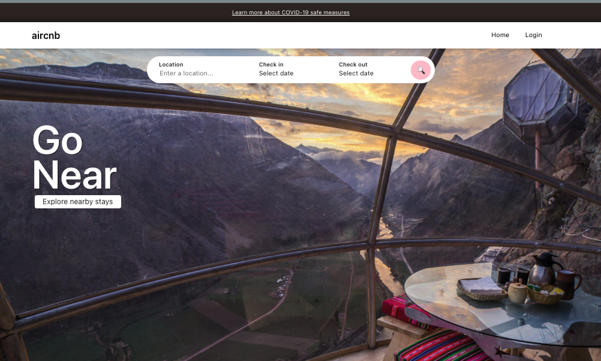

then the user needs to login:

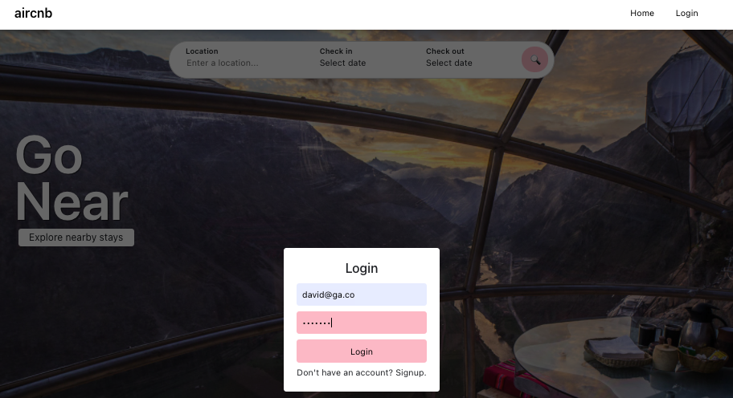

choose for the check in date:

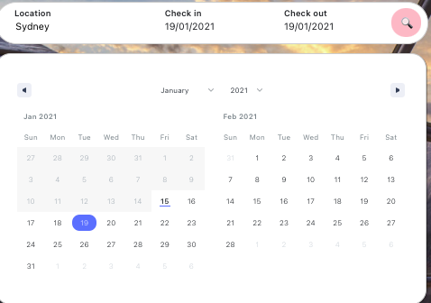

choose for the check out date:

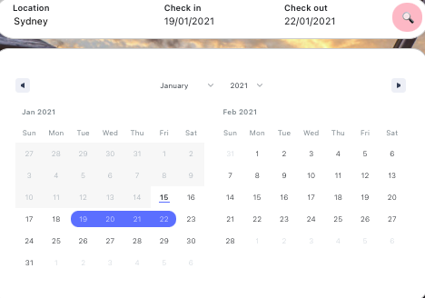

once you have pressed the search button you can see the results:

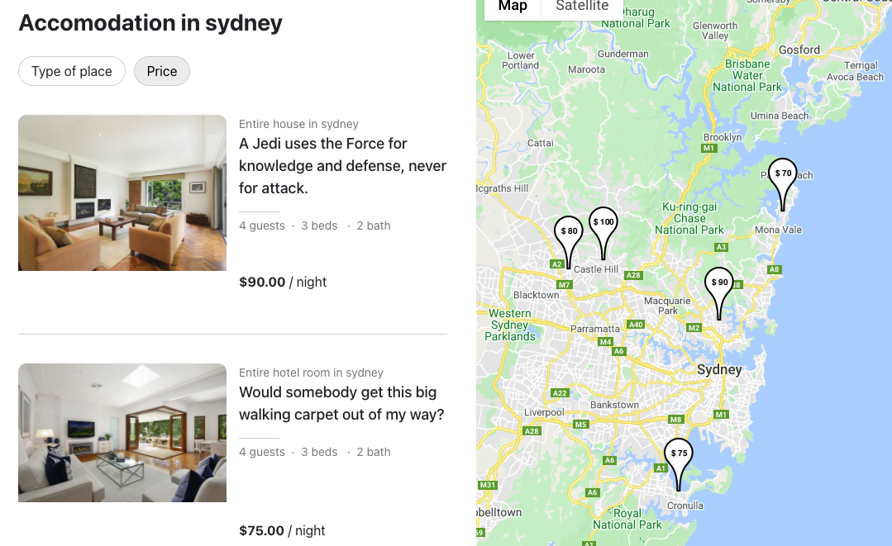

once you choose the place you can see more details about the property:

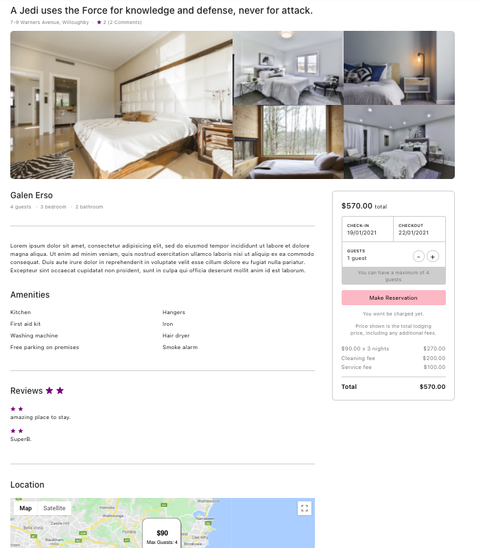

Once you like the place and you are ready to pay you go to the next page:

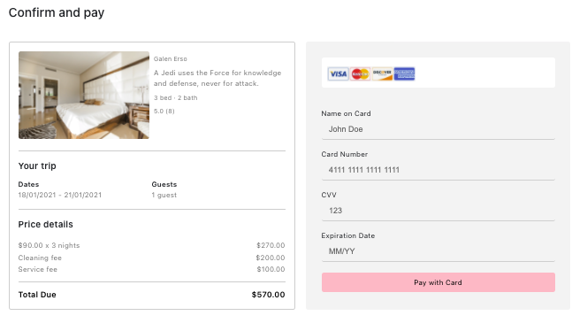

Once you pay you will see the booking confirmation

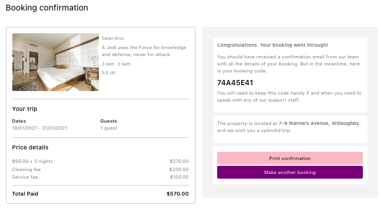

If you have any problems or feedback you can contact the admin:

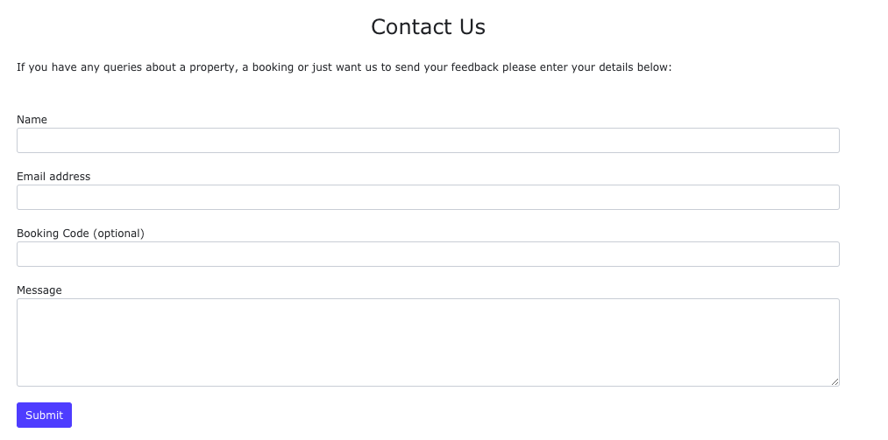

There is also a page about us:

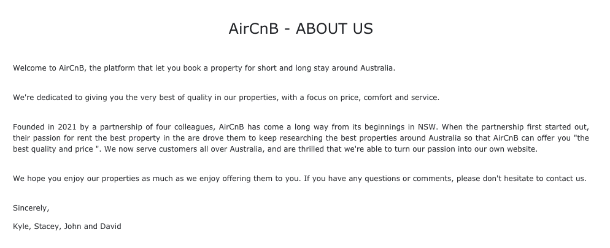

and also about Terms and Conditions:

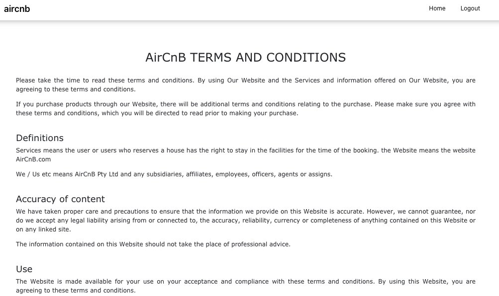

Known bugs
------------------------------------------------------
TBA

Future features
------------------------------------------------------
User will be able to favourite Properties
